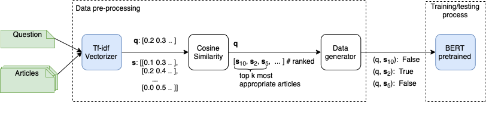

# Vietnamese Legal Text Retrieval
Our repository is based on [this approach](https://github.com/phuongnm-bkhn/legal_text_retrieval). In this work, we focus on building a website to interact with the retrieval system easily. All information about training and evaluation, you can find in this repository we mentioned above.
## Overview 
This system contains 2 steps: 
- generate training data containing negative sample found by mixture score of cosine(tfidf) + bm25 (using top 150 law articles most similarity)
- fine-tune PhoBERT model  (+NlpHUST model - optional) on generated data 


## Environments
```bash 
git clone https://github.com/vncorenlp/VnCoreNLP.git vncorenlp_data 
# for vncorebnlp tokenize lib
```
## Run  
1. Download preprocessing data and the model:
- Install ```gdown``` first
  ```bash
  pip3 install gdown
  ```
- Download data and model
  ```bash
  bash prepare.sh 
  ```
2. Run the service using docker-compose:
  ```bash
    docker-compose build
    docker-compose up
  ```
Note: 
+ The backend service use port 5002, and the frontend service use port 5000. You can change the port by passing in ```docker-compose.yml```.
+ If you face with any errors, don't hesitate to create a new issue. 
